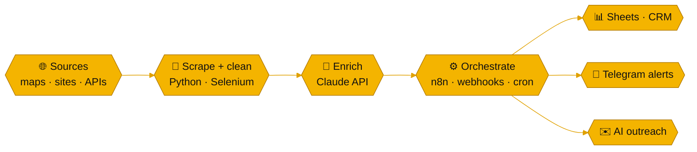

<!-- 🐝  Stinger · The Bee That Codes — profile README
     Header/footer art lives in /assets. Cards are rebuilt by .github/workflows/hive.yml
     and published to the `output` branch, so this file never needs touching to stay fresh. -->

<p align="center">
  
</p>

<p align="center">
  <a href="https://aymannaghi.com"></a>
  <a href="https://linkedin.com/in/ayman-naghi-832b33231"></a>
  <a href="https://x.com/aymanaghi"></a>
  <a href="https://linkedin.com/in/ayman-naghi-832b33231"></a>
</p>

## 🐝 whoami

```yaml
# ~/.config/stinger/whoami.yml
name:          Ayman Naghi          # a.k.a. Stinger — the bee that codes
role:          Automation Engineer · AI Workflow Architect
based_in:      Lebanon → remote-first
daily_driver:  Fedora Linux + kitty + starship
builds:
  - scrapers that feed pipelines
  - pipelines that feed CRMs & Google Sheets
  - Telegram bots that report back when the job is done
  - trading bots that never sleep
now_building:  a Next.js + TypeScript car-import platform (Korea → Germany)
leveling_up:   QA automation / SDET — testing the systems I automate
motto:         "Don't do manually what a machine can do better."
```

## 🍯 How the hive works

Most of what I ship is a remix of one loop: data in, people out of the boring parts.



## 🔥 Featured builds

<table>
<tr>
<td width="50%" valign="top">

**🧠 [AI Outreach Engine](https://github.com/aymanaghi/n8n)**

n8n + Python pipeline that runs lead gen end to end: scraper → webhook → validation → dedupe → Google Sheets CRM → AI-written emails → Telegram alerts.

`n8n` `Python` `Google Sheets` `Telegram` `LLMs`

</td>
<td width="50%" valign="top">

**🏙️ [Dubai Leads System](https://github.com/aymanaghi/dubai-leads-system)**

Real-estate lead machine: Google Maps scraping → normalization & dedupe → Claude enrichment and personalized copy → n8n into HubSpot + Sheets. The repo holds its Next.js landing page.

`Python` `Claude API` `n8n` `HubSpot` `Next.js`

</td>
</tr>
<tr>
<td width="50%" valign="top">

**🕷️ [ScraperPro](https://github.com/aymanaghi/scaperpro)**

Terminal web scraper: searches DuckDuckGo, Bing and Wikipedia, pulls emails, phones, socials and tables, crawls whole sites, rotates user agents and proxies, exports JSON / CSV / TXT.

`Python` `multithreaded` `BeautifulSoup` `CLI`

</td>
<td width="50%" valign="top">

**🗺️ [maps-scraper](https://github.com/aymanaghi/maps-scraper)**

Google Maps business harvester: name, rating, address and website for any query + location, saved as clean JSON / CSV ready for a pipeline.

`Python` `Selenium` `BeautifulSoup`

</td>
</tr>
<tr>
<td width="50%" valign="top">

**🎮 [RustBot](https://github.com/aymanaghi/rustbot)**

Telegram control panel for Steam: live Rust-skin inventory with market prices, send / accept / cancel trade offers, one-tap auto-accept, all from your phone.

`Python` `Telegram Bot API` `Steam`

</td>
<td width="50%" valign="top">

**🧪 [SetLib](https://github.com/aymanaghi/setlib)**

Nested mathematical Set class in C++17, shipped the QA way: 31 UnitTest++ cases, coverage reports, Doxygen docs and a CMake build.

`C++17` `UnitTest++` `coverage` `CMake`

</td>
</tr>
</table>

### 🔒 Shipped privately

- 📉 **Binance futures bot**: EMA/RSI strategy, Telegram controls, running as a systemd service on a Hetzner VPS
- 💸 **Expense tracker bot**: message it on Telegram, Claude API categorizes the spend, Google Sheets keeps the books
- 🎯 **Job-hunt autopilot**: pulls roles from RemoteOK, We Work Remotely and LinkedIn into a Sheets tracker with Telegram pings
- 🇸🇦 **Saudi B2B lead engine**: Arabic + English scraping across 15 cities, exported as scored CSVs
- 🚗 **Car-import platform** *(in progress)*: Next.js + TypeScript, live Korean listings, EUR price calculator, inspection booking

<details>
<summary><b>🧰 More tools from the hive</b></summary>
<br />

| | Tool | What it does |
| :-: | --- | --- |
| 🔐 | [stinger-pwgen](https://github.com/aymanaghi/stinger-pwgen) | 64-character passwords with optional Fernet encryption and a Rich terminal UI |
| 🕵️ | [osint-toolkit](https://github.com/aymanaghi/osint-toolkit) | Username, IP and WHOIS recon from the terminal |
| 📈 | [cs2-market-tools](https://github.com/aymanaghi/cs2-market-tools) | CS2 market-cap validator with terminal charts |
| 🎥 | [scrcpy-obs-bot](https://github.com/aymanaghi/scrcpy-obs-bot) | One key to record Android via scrcpy and OBS at the same time |
| 🍯 | [HoneyVault-Backup](https://github.com/aymanaghi/HoneyVault-Backup) | Mirrors an Obsidian vault to USB the moment it's plugged in |
| 🪙 | [crypto-news-cli](https://github.com/aymanaghi/crypto-news-cli) | Crypto headlines in your shell, powered by CryptoPanic |
| 📚 | [bookfinder-cli](https://github.com/aymanaghi/bookfinder-cli) | Search, download and read Project Gutenberg books from the terminal |
| 🔢 | [binary-fun-](https://github.com/aymanaghi/binary-fun-) | A joyful binary converter with Rich animations |
| 🐧 | [fedora-respo](https://github.com/aymanaghi/fedora-respo) | Copy-paste-friendly Fedora knowledge base and tuning configs |
| 🛰️ | [nmap](https://github.com/aymanaghi/nmap) | Beginner-friendly Nmap setup guide for every OS |

</details>

## 🧰 Stack

<p align="center">
  
</p>

<p align="center">
  
  
  
  
  
  
  
  
  
  
</p>

## 📊 Hive activity

<p align="center">
  <picture>
    <source media="(prefers-color-scheme: dark)" srcset="https://raw.githubusercontent.com/aymanaghi/aymanaghi/output/top-langs-dark.svg" />
    
  </picture>
  <picture>
    <source media="(prefers-color-scheme: dark)" srcset="https://streak-stats.demolab.com?user=aymanaghi&timezone=Asia/Beirut&hide_border=true&border_radius=10&card_width=495&card_height=190&background=161B22&stroke=30363D&ring=F4B400&fire=F4B400&currStreakNum=F4B400&currStreakLabel=F4B400&sideNums=E6EDF3&sideLabels=8B949E&dates=8B949E" />
    
  </picture>
</p>

<picture>
  <source media="(prefers-color-scheme: dark)" srcset="https://raw.githubusercontent.com/aymanaghi/aymanaghi/output/snake-dark.svg" />
  
</picture>

## 📬 Let's build something

<p align="center">
  <b>Got a process that eats your team's hours?</b> I'll turn it into a workflow that runs itself.<br />
  Open to <b>automation contracts</b>, <b>AI workflow builds</b> and <b>remote QA automation / SDET roles</b>.<br />
  <a href="https://aymannaghi.com">aymannaghi.com</a> · <a href="https://linkedin.com/in/ayman-naghi-832b33231">LinkedIn</a> · <a href="https://x.com/aymanaghi">@aymanaghi</a>
</p>

## 💛 Fuel the hive

<details>
<summary><b>If one of my tools saved you time, a tip keeps the bee buzzing. Tap for addresses 🐝</b></summary>
<br />


```text
15TnWYZySMC8KHuoAWQQsMAKJWts8g8fua
```


```text
0xdbAB2a1c7FaAC113384741BB7769BE1E023C2109
```


```text
TLf9qkWBBxH1NPVQFg2ZzcxZrsbCy7p31T
```

<p>
  
</p>

<!-- Binance Pay QR: upload the image as assets/binance-pay-qr.jpg, then put this line back inside the <p> above (after a <br />):
  
-->

</details>

<p align="center">
  
</p>

<p align="center"><sub>Built in the hive by <b>Stinger</b>, the bee that codes 🐝 · cards refresh themselves twice a day</sub></p>
